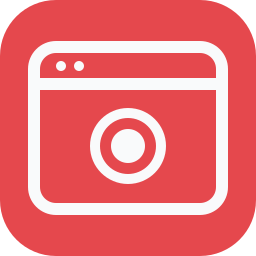

<p align="center">
  
</p>

# Browser Recorder for Codex

Turn a short browser flow into a local video—without leaving Codex.

Browser Recorder opens one fresh Chrome tab, follows the actions you approve,
and saves the result as an MP4. Pointer flows include a visible cursor
and click feedback, so the recording is easy to follow in a bug report, QA
note, or review.

Recordings stay on your Mac. The plugin does not upload or share them, add
telemetry, capture audio, or record your other tabs.

> [!NOTE]
> This is an experimental, community-developed Codex plugin. The current
> release supports the Codex desktop app on macOS with Chrome.

## Before you record

> [!WARNING]
> Record only public, non-sensitive pages and actions that everyone affected
> has agreed may be recorded.

- A fresh tab may reuse Chrome's existing session. Use a logged-out Chrome
  profile without sensitive or personalized content.
- The recording includes the complete visible page viewport, including all
  visible embedded frames.
- If the page sends the tab to another website, recording stops without saving
  a video.
- Never record credentials, payment details, private messages, health data,
  account-recovery secrets, or other sensitive content.

See the [privacy policy](PRIVACY.md) for the complete data boundary, retention,
cleanup, and failure behavior.

## Quick start

### 1. Install the prerequisites

You will need:

- the Codex desktop app on macOS;
- the official [Chrome plugin and extension](https://learn.chatgpt.com/docs/chrome-extension);
- **Settings > Browser > Developer mode > Enable full CDP access** turned on;
- FFmpeg and FFprobe with H.264 and MP4 support.

Homebrew users can install the media tools with:

```sh
brew install ffmpeg
```

In the ChatGPT desktop app, open **Codex > Plugins**, search for
**Codex Browser Recorder**, and install it. Install **Chrome** there too, finish
the extension setup, then start a new task. If the recorder is not listed for
your account or workspace, use the [local checkout](#install-from-a-local-checkout)
below.

### 2. Check your setup

Ask Codex to run the recorder's read-only preflight:

```text
$codex-browser-recorder:record-browser Check whether my local recording environment is ready.
```

A successful check begins with `Local recording preflight passed`. It checks
your Mac, media tools, and output folder without opening Chrome. Chrome
permissions are requested later, when you record.

### 3. Record your first flow

Try a short, public, logged-out page:

```text
$codex-browser-recorder:record-browser Open https://www.w3.org/TR/pointerevents/, click the 1. Introduction link in the table of contents, and save the approved flow as pointer-events-intro.
```

Before Chrome opens, Codex shows the page, actions, duration, and output name
for your approval. When the flow finishes, the video is saved to
`~/Downloads/Codex Browser Recordings/` by default.

## What you get

| | |
| --- | --- |
| **A focused capture** | One approved flow in one fresh Chrome tab—never the Codex UI, browser chrome, or your other tabs. |
| **A ready-to-use file** | A local H.264 MP4, capped at 720p and encoded at 10 frames per second with no audio. |
| **Visible actions** | Pointer flows show the cursor and click feedback. |
| **Private by default** | The video is created on your Mac, and page images are not sent to the model. There is no automatic upload, sharing, or telemetry. |

The fixed video profile is designed for short test evidence, not high-motion
product demos.

## Current limits

- macOS and Chrome only; the Codex in-app Browser is not supported.
- One fresh tab and one approved website at a time.
- Public `https:` pages, plus explicit loopback development pages on
  `localhost`, `127.0.0.1`, or `[::1]`.
- An optional duration from 5 to 60 seconds. Action-driven recordings can stop
  after the approved actions; passive or wait-only recordings require an
  explicit duration.
- No audio, authenticated flows, multiple tabs, uploads, remote storage, or
  navigation to another website.

## Install from a local checkout

Add this repository as a local marketplace:

```sh
codex plugin marketplace add /absolute/path/to/codex-browser-recorder
codex plugin add codex-browser-recorder@codex-browser-recorder
```

Start a new Codex task after installing. Do not copy files into the plugin cache
or edit cache contents by hand.

<details>
<summary>Install and verify the current versioned release</summary>

Use a release tag when you need to reproduce the published plugin:

```sh
git clone --branch v0.3.3 --depth 1 https://github.com/flsteven87/codex-browser-recorder.git
codex plugin marketplace add /absolute/path/to/codex-browser-recorder
```

The [v0.3.3 release page](https://github.com/flsteven87/codex-browser-recorder/releases/tag/v0.3.3)
lists the release commit. You can also verify the downloaded archive:

```sh
recorder_release=v0.3.3
recorder_archive="codex-browser-recorder-${recorder_release}.zip"
curl --fail --location --remote-name \
  "https://github.com/flsteven87/codex-browser-recorder/releases/download/${recorder_release}/${recorder_archive}"
curl --fail --location --remote-name \
  "https://github.com/flsteven87/codex-browser-recorder/releases/download/${recorder_release}/${recorder_archive}.sha256"
shasum -a 256 -c "${recorder_archive}.sha256"
```

The checksum covers the versioned archive. For stricter reproducibility, also
pin the full release commit.

</details>

## Documentation

- **Can't install or record?** Start with
  [Troubleshooting](docs/troubleshooting.md).
- **Need the full data boundary?** Read [Privacy](PRIVACY.md).
- **Found a bug?** Follow [Support](SUPPORT.md) to share a safe report.
- **Found a security issue?** Use the private process in
  [Security](SECURITY.md).
- **Want to contribute?** See [Contributing](CONTRIBUTING.md).
- **Want to understand the internals?** Read
  [Architecture](docs/architecture.md).
- **Looking for release history?** Open the [Changelog](CHANGELOG.md).

## Development

Repository development requires Node.js 24 or newer. There are no npm runtime
dependencies and no development server.

```sh
npm run check
```

See [CONTRIBUTING.md](CONTRIBUTING.md) for the full validation and
real-Chrome release process.

<details>
<summary>Update or uninstall a local installation</summary>

Reinstall after updating the local checkout:

```sh
codex plugin remove codex-browser-recorder@codex-browser-recorder
codex plugin add codex-browser-recorder@codex-browser-recorder
```

Remove both the plugin and its local marketplace:

```sh
codex plugin remove codex-browser-recorder@codex-browser-recorder
codex plugin marketplace remove codex-browser-recorder
```

Start a new task after changing installed plugins.

</details>

## Browser Recorder and Record & Replay

Browser Recorder creates a local video of a visible page flow. Codex
[Record & Replay](https://learn.chatgpt.com/docs/extend/record-and-replay)
turns a demonstrated workflow into a reusable skill. They are separate
features.

## License

[MIT](LICENSE)
