# Browser Recorder for Codex

Browser Recorder is an experimental, community-developed Codex plugin that
records the page content of one explicitly approved Codex in-app Browser tab to
a local WebM file. It reuses the installed Browser plugin's permission-gated CDP
session and keeps recording data on the local machine.

The current plugin implements a fixed `https://example.com/` integration gate.
It is installable, its automated packaging gate passes, and its approved
fresh-task desktop integration gate passed on 2026-07-15. Treat it as an
open-source alpha, not a general-purpose production recorder.

## Status

| Gate | Status | Evidence |
| --- | --- | --- |
| Phase 0 visible capture | PASS | Approved CDP capture, FFmpeg encoding, and FFprobe validation passed. |
| Phase 0 hidden capture | PASS | A two-minute hidden recording continued receiving and acknowledging fresh frames. |
| Phase 0 interaction fidelity | PASS | Typing, scrolling, DOM state change, and navigation were captured. |
| Phase 1 plugin and skill validation | PASS | Official Codex plugin and skill validators pass. |
| Phase 1 isolated installation | PASS | Codex installs from a temporary marketplace and imports the recorder after the source fixture is removed. |
| Phase 1 automated tests | PASS | 71 tests; enforced coverage is at least 90% lines and 80% branches. |
| Phase 1 fresh desktop task | PASS | Installed-cache run produced one validated 11.7-second VP8 WebM; 468/468 frames were acknowledged and cleanup left no active handle or Browser tab. |
| Phase 1 decision | GO | Approved for the fixed-origin open-source alpha milestone; broader recording remains out of scope. |

Measured Phase 0 evidence and the approved Phase 1 design are documented in:

- [Project design](docs/superpowers/specs/2026-07-15-codex-browser-recorder-design.md)
- [Phase 0 execution evidence](docs/superpowers/plans/2026-07-15-phase-0-browser-screencast-poc.md)
- [Phase 1 integration design](docs/superpowers/specs/2026-07-15-phase-1-plugin-integration-gate-design.md)
- [Phase 1 implementation plan](docs/superpowers/plans/2026-07-15-phase-1-plugin-integration-gate.md)

## What It Does

- Records one fresh, approved in-app Browser test tab.
- Acknowledges every valid CDP screencast frame before processing it.
- Retains only the latest bounded JPEG frame for fixed-rate sampling.
- Encodes an audio-free VP8 WebM through local FFmpeg.
- Applies duration, output-size, frame-stall, payload-size, and encoder-shutdown
  limits.
- Publishes the final video atomically only after successful encoding.
- Validates exact WebM `DocType`, one VP8 video stream, no audio streams,
  dimensions, size, and plausible duration.
- Writes a private sanitized JSON result with bounded counters and stable failure
  codes.

It does not record Codex UI, browser chrome, audio, cookies, storage, request
headers, credentials, other tabs, or an entire browser profile. It does not
upload recordings, enable Browser Developer mode, change workspace policy, or
bypass site/full-CDP approval.

## Requirements

- macOS with the Codex desktop app
- A current Browser plugin runtime capable of importing the bundled Node modules
- `ffmpeg` and `ffprobe` on `PATH`
- The Codex Browser plugin installed and available
- Browser Developer mode with full CDP access enabled by the user
- Explicit approval for the fixed test origin and CDP session

The Browser plugin is a separate prerequisite. This repository does not bundle
or initialize a replacement browser client. The Browser execution surface does
not expose global `process` metadata; the environment doctor derives macOS from
`node:os` and verifies FFmpeg tools through bounded, shell-free inherited
command resolution. Node.js 24 or newer is required only for local development
and repository verification.

The environment doctor feature-detects the `libvpx` VP8 encoder, WebM muxer,
and usable FFprobe JSON surface. Executable presence or a version string alone
is not treated as compatibility.

## Install

Add the Git repository as a Codex marketplace and install the plugin:

```sh
codex plugin marketplace add https://github.com/flsteven87/codex-browser-recorder.git
codex plugin add codex-browser-recorder@codex-browser-recorder
```

For local development, use the repository root instead:

```sh
codex plugin marketplace add /absolute/path/to/codex-browser-recorder
codex plugin add codex-browser-recorder@codex-browser-recorder
```

Start a new Codex task after installation so Codex discovers the installed
skill. If a task created in the same running app session does not yet list the
new or upgraded skill, restart the Codex app and create another task. Do not
copy files into the Codex plugin cache, guess cache paths, or edit cache
contents by hand.

## Run the Integration Gate

Explicitly invoke:

```text
$record-browser
```

The skill must then:

1. confirm the fixed origin, 10–15 second duration, local temporary output, and
   disposable test-page modifications;
2. connect to the installed in-app Browser runtime and create a fresh
   `https://example.com/` tab;
3. wait for normal site and full-CDP approval;
4. run the environment doctor and start recording;
5. add a test clock/animation, perform a scroll and DOM state change, and verify
   frame progress;
6. finalize and validate the video;
7. let the runtime gate clear its singleton state, then have the skill close the
   fresh tab on every path.

Approval denial returns `cancelled` and is never retried or bypassed. The skill
uses `policy.allow_implicit_invocation: false`; merely installing the plugin or
using the Browser does not authorize recording.

## Output

Each run receives a unique `0700` directory under the operating system's
temporary root:

- `recording.webm` — published only after successful encoder finalization;
- `result.json` — written with mode `0600`, containing schema version, status,
  bounded capture counters, validation metadata, and a stable failure code.

Failed or cancelled recordings remove partial video output. Result data excludes
raw frames, CDP payloads, FFmpeg stderr, full URLs, page text, credentials, and
internal plugin-cache paths. The user controls retention and deletion of the
local output directory.

## Architecture

```mermaid
flowchart LR
    U["Explicit $record-browser invocation"] --> S["Installed record-browser skill"]
    S --> G["Deterministic fixed example.com gate"]
    G --> B["Installed Browser runtime"]
    B --> T["One fresh approved tab"]
    T --> C["Permission-gated CDP screencast"]
    C --> P["Bounded frame pump and acknowledgements"]
    P --> F["Local FFmpeg VP8 encoder"]
    F --> A["Atomic WebM publication"]
    A --> V["EBML and FFprobe validation"]
    V --> R["Local WebM and sanitized result"]
```



The recorder module is imported into the same persistent JavaScript runtime
that owns the Browser tab binding. It reacquires the tab's current CDP
capability after navigation; it never passes a tab ID to another process and
assumes the capability can be reconstructed there.

The installed skill calls the deterministic `createExampleRecording()` gate.
That gate verifies the exact top-level URL through the same reacquired CDP
session immediately before capture, enforces one active recording per Browser
runtime, and applies a non-overridable 20-second hard limit. The skill still
owns explicit consent, fresh-tab creation, disposable test interactions, and
closing the tab.

The public runtime handle is deliberately limited to `ready`, `status()`, and
idempotent `stop()`. Status exposes only bounded counters and one of
`recording`, `stopping`, `completed`, or `failed`.

## Development and Verification

The repository has no npm runtime dependencies and does not require a dev
server. Tests use real local FFmpeg/FFprobe processes but never access a browser
profile or write recordings into the repository.

```sh
npm run check
npm run test:coverage
npm run test:plugin-install
```

`npm run test:plugin-install` requires the `codex` CLI. It sets both `HOME` and
`CODEX_HOME` to disposable directories, installs from a copied marketplace,
deletes that source copy, imports from the isolated plugin cache, and removes the
entire fixture afterward.

Run the official metadata validators with transient PyYAML rather than adding a
project dependency:

```sh
PLUGIN_CREATOR=/absolute/path/to/plugin-creator
SKILL_CREATOR=/absolute/path/to/skill-creator
uv run --with pyyaml python "$PLUGIN_CREATOR/scripts/validate_plugin.py" plugins/codex-browser-recorder
uv run --with pyyaml python "$SKILL_CREATOR/scripts/quick_validate.py" plugins/codex-browser-recorder/skills/record-browser
```

The absolute validator paths above are for a local Codex development
installation; adjust them to the installed Codex skills root on another machine.

## Update or Uninstall

For a Git marketplace update, refresh the snapshot and reinstall the plugin in a
new task:

```sh
codex plugin remove codex-browser-recorder@codex-browser-recorder
codex plugin marketplace upgrade codex-browser-recorder
codex plugin add codex-browser-recorder@codex-browser-recorder
```

To uninstall both the plugin and its marketplace source:

```sh
codex plugin remove codex-browser-recorder@codex-browser-recorder
codex plugin marketplace remove codex-browser-recorder
```

## Privacy and Security

Record only non-sensitive test flows with the informed consent of everyone whose
data may appear. Do not record passwords, payment forms, passkeys, recovery
secrets, health information, private messages, or other confidential content.

See [PRIVACY.md](PRIVACY.md) and [SECURITY.md](SECURITY.md). Report security
issues through [GitHub private vulnerability reporting](https://github.com/flsteven87/codex-browser-recorder/security/advisories/new),
not a public issue.

## License

[MIT](LICENSE)
