# Browser Recorder for Codex

Browser Recorder is an experimental, community-developed Codex plugin that
records one explicitly approved test flow in a fresh tab in the browser selected
by the installed Browser plugin and saves it as a cursor-complete local MP4.
The recording contains the page viewport plus a project-owned Codex-style
cursor and click feedback, uses H.264 video with no audio, and defaults to
`~/Downloads/Codex Browser Recordings/` so the user can find and retain it.

The plugin reuses the installed Browser plugin's permission-gated CDP session.
It does not record Codex UI, browser chrome, other tabs, or an entire browser
profile, and it does not add an upload or sharing path.

## Status

This checkout prepares version `v0.2.0`. Its automated repository test,
coverage, eval, isolated-install, metadata, asset, release, real cursor-output,
and two-run installed-desktop gates pass. The immutable `v0.2.0` tag remains a
release-operator step; the mutable `main` branch is not a supported release
source.

Publication in the universal Plugin Directory is a separate OpenAI review and
publisher-controlled release process. Until the `v0.2.0` tag is published,
`v0.1.0` remains the latest immutable installation source.

Authenticated or sensitive flows remain out of scope. Use the plugin only for
non-sensitive test pages and actions that every affected person has agreed may
be recorded.

## Supported Targets

The public workflow accepts:

- `https:` URLs without embedded usernames or passwords;
- explicitly approved loopback development URLs using `http:` with
  `localhost`, `127.0.0.1`, or `[::1]`;
- one fresh tab in the browser selected by the installed Browser plugin, one
  normalized approved origin, and only the Browser actions listed in the user's
  consent;
- durations from 5 through 60 seconds, with 15 seconds as the default.

Pointer actions in supported embedded frames, including cross-origin and
out-of-process iframes observable through public CDP, are composited into the
recording. Existing tabs, multiple tabs, non-loopback `http:` targets, URL
credentials, audio, authenticated or sensitive flows, and cross-origin
top-frame navigation are not supported.

## Requirements

- macOS with the Codex desktop app
- The Codex Browser plugin installed and available
- A Browser runtime capable of importing the plugin's bundled Node modules
- Browser Developer mode with full CDP access already enabled by the user
- `ffmpeg` and `ffprobe` on `PATH`, including the `libx264` H.264 encoder, MP4
  muxer, and usable FFprobe JSON output

The recorder runs a read-only environment check before capture. It does not
enable Developer mode, change policy, install packages, or bypass normal site
or full-CDP approval. Node.js 24 or newer is required only for repository
development and verification.

## Pinned Release and Local Installation

A reproducible v0.2 installation uses the canonical `v0.2.0` tag after it is
published. Do not treat the mutable `main` branch as a release source, copy
files into the Codex plugin cache, or edit cache contents by hand.

For local development, add the repository root as a local marketplace and
install the plugin:

```sh
codex plugin marketplace add /absolute/path/to/codex-browser-recorder
codex plugin add codex-browser-recorder@codex-browser-recorder
```

A pinned installation can use a checkout of that exact tag as the local
marketplace source:

```sh
git clone --branch v0.2.0 --depth 1 https://github.com/flsteven87/codex-browser-recorder.git
codex plugin marketplace add /absolute/path/to/codex-browser-recorder
codex plugin add codex-browser-recorder@codex-browser-recorder
```

Start a new Codex task after installation so Codex discovers the skill. If a
new task in the same app session does not list the installed or upgraded skill,
restart Codex and create another task.

## Use `$record-browser`

Explicitly invoke `$record-browser` and provide:

- the target URL;
- the Browser actions to perform;
- an optional recording duration;
- an optional absolute destination folder; and
- an optional recording name.

Mentioning `$record-browser` selects the workflow but does not approve an
unknown target or scope. The skill validates the request locally before any
Browser activity, creates one fresh blank tab only after consent, performs only
the approved actions, finalizes the recording, attempts to close the fresh tab
on every path, and reports bounded manual cleanup instructions if closure fails.
It otherwise reports either the local result or an allowlisted failure.

Approval denial returns `cancelled`. The plugin never retries or bypasses a
denied site or CDP approval.

## Consolidated Consent

Before creating or navigating a Browser tab, the skill presents one
consolidated consent request containing the normalized approved origin, planned
actions, duration, Saved Recording destination and filename, H.264 MP4 with no
audio, the visible project-owned cursor and click feedback, no browser chrome,
no other tabs, and the sensitive-data exclusion.
Recording begins only after the user explicitly confirms that complete scope.
If macOS denies access to the destination, the run stops before creating a
Browser tab and never falls back silently to temporary storage.

Credentials, payment data, passkeys, account-recovery secrets, health data,
confidential communications, and other sensitive authenticated flows must be
refused.

## Same-Origin Navigation Policy

Consent is locked to one normalized origin. Same-origin path, query, fragment,
redirect, and single-page-application state changes may remain recordable when
they are part of the approved actions.

A cross-origin top-frame navigation stops the session, discards the entire
recording, and returns `origin_changed_during_recording`. The skill does not
broaden the approved origin during a run.

## Output and Deletion

Each run uses a unique Working Recording directory with mode `0700` under the
operating system's temporary root. The default durable destination is
`~/Downloads/Codex Browser Recordings/`; callers may choose another absolute
local directory before consent. Default filenames use
`browser-recording-YYYY-MM-DD-HHmmss.mp4` and never derive from the page title,
host, URL, or page text. Explicit custom names are cleaned before use. A
collision adds a short recording ID instead of overwriting an existing file.

A pointer-driven run is successful only when its planned actions produce
new Browser-dispatched pointer events in the top-level page or supported
embedded frames;
each event must occur at or after its current action boundary, and every
planned pointer action is checked before the next action begins.
Cursor observation, coordinate mapping, composition, or cleanup failure
discards the Working Recording. A run is successful only after the Working
Recording validates as one H.264
`yuv420p` video stream in an MP4 container, contains no audio, and is atomically
published as the Saved Recording with mode `0600`. The private schema-v3 result
contains bounded counters, validation metadata, an output filename, and
allowlisted status or failure information; it excludes raw frames, CDP
payloads, FFmpeg output, full URLs, page text, credentials, and internal plugin
paths.

Capture, cancellation, cross-origin, and validation failures do not publish a
Saved Recording; the transaction discards their Working Recording. If that
automatic cleanup fails, the plugin reports the local path for deletion. If
durable publication fails after validation, the plugin reports
`saved_recording_persistence_failed` and the retained Working
Recording recovery directory so the user can copy it to a durable folder. It
never reports `Recording completed` for temporary output. The plugin does not
automatically open, play, upload, or share recordings.

## Architecture

```mermaid
flowchart LR
    U["Explicit $record-browser invocation"] --> P["Local request policy"]
    P --> C["One consolidated consent"]
    C --> D["Saved destination capability preflight"]
    D --> B["One fresh approved Browser tab"]
    B --> R["Public createRecording coordinator"]
    R --> O["Continuous approved-origin enforcement"]
    O --> F["Page frames and isolated-world pointer observers"]
    F --> C2["Deterministic cursor composition"]
    C2 --> V["H.264 MP4 validation"]
    V --> A["Saved Recording transaction"]
```



The skills-only plugin runs inside the same persistent Browser Node runtime
that owns the tab binding. `createRecording()` is the production coordinator;
its public handle exposes only `ready`, `status()`, and idempotent `stop()`.
The runtime reacquires the current CDP capability, continuously checks
top-frame navigation against the approved origin, enforces bounded resources,
and releases its singleton reservation on every terminal path.

## Development Verification

The repository has no npm runtime dependencies and requires no development
server. Tests use local FFmpeg and FFprobe processes but do not access a browser
profile or write recording artifacts into the repository.

```sh
npm run check
npm run test:coverage
npm run test:plugin-install
```

`npm run test:plugin-install` requires the `codex` CLI. It isolates both `HOME`
and `CODEX_HOME`, installs from a copied marketplace, removes the source copy,
imports the coordinator from the isolated installed cache, and deletes the
fixture afterward.

Repository maintainers can run the official metadata validators from the
installed Codex system skills without adding a project dependency:

```sh
uv run --no-project --with pyyaml python /path/to/plugin-creator/scripts/validate_plugin.py plugins/codex-browser-recorder
uv run --no-project --with pyyaml python /path/to/skill-creator/scripts/quick_validate.py plugins/codex-browser-recorder/skills/record-browser
```

## Internal Release Gate

The fixed example scenario is repository-only release tooling, not a public
plugin mode or starter prompt. It exercises the same production
`createRecording()` entry point with deterministic disposable actions. The
separate release-readiness process must execute its installed-desktop scenario
twice sequentially and record only sanitized evidence before a public release.

Users do not need this internal example scenario to record an approved test
flow.

## Update or Uninstall

For a local marketplace checkout, update that checkout to the intended pinned
revision, then reinstall the plugin in a new Codex task:

```sh
codex plugin remove codex-browser-recorder@codex-browser-recorder
codex plugin add codex-browser-recorder@codex-browser-recorder
```

To uninstall both the plugin and its marketplace source:

```sh
codex plugin remove codex-browser-recorder@codex-browser-recorder
codex plugin marketplace remove codex-browser-recorder
```

## Privacy and Security

Frames are processed by the local Browser Node runtime and local FFmpeg; the
skill does not place them in model context. The plugin sends no telemetry and
does not automatically upload, share, or retain recordings remotely. See
[PRIVACY.md](PRIVACY.md) for retention and deletion responsibilities.

Record only non-sensitive test flows with the informed consent of everyone
whose data may appear. See [SECURITY.md](SECURITY.md) and report security issues
through [GitHub private vulnerability reporting](https://github.com/flsteven87/codex-browser-recorder/security/advisories/new),
not a public issue.

For use conditions, support boundaries, and project participation, see
[TERMS.md](TERMS.md), [SUPPORT.md](SUPPORT.md),
[CONTRIBUTING.md](CONTRIBUTING.md), and
[CODE_OF_CONDUCT.md](CODE_OF_CONDUCT.md). Release-facing changes are tracked in
[CHANGELOG.md](CHANGELOG.md).

## Record & Replay

Browser Recorder and Codex Record & Replay solve different problems. This
plugin captures the visible page flow as a local MP4 for review; it does not
turn the demonstrated actions into an automation or reusable skill. Record &
Replay turns a demonstrated workflow into a reusable Codex skill rather than a
video artifact.

<details>
<summary>Design references</summary>

- [Project design](docs/superpowers/specs/2026-07-15-codex-browser-recorder-design.md)
- [Phase 1 integration design](docs/superpowers/specs/2026-07-15-phase-1-plugin-integration-gate-design.md)
- [Public runtime product design](docs/superpowers/specs/2026-07-15-public-browser-recorder-product-design.md)

</details>

## License

[MIT](LICENSE)
