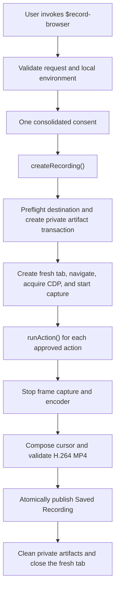

# Architecture

Browser Recorder separates user authorization from deterministic recording
code. The `$record-browser` skill owns intent, consent, browser selection, and
approved actions. Local modules own capture, evidence, validation, publication,
and cleanup. Neither layer may silently broaden the approved origin, browser,
actions, duration, or destination.

## System flow

Validation happens before Browser activity. Consent happens before tab creation
or CDP access. Publication happens only after capture and media validation pass.
Cleanup runs on success, cancellation, and failure.

## Ownership boundaries

| Layer | Owns | Must not own |
| --- | --- | --- |
| `$record-browser` skill | Request collection, local preflight, consent, Browser selection, concrete approved actions, user-facing result | Raw capture internals, durable publication, direct artifact cleanup |
| `createRecording()` coordinator | One Recording Session, fresh-tab lifecycle, action boundary, terminal result, idempotent cleanup | Deciding new actions or expanding consent |
| Browser recording | CDP capability, origin checks, bounded frame capture, resource limits | User-visible error details or output publication |
| Cursor recording | Pointer observation, frame-coordinate mapping, cursor and click-feedback composition | Authenticating whether an observed event came from a human |
| Artifact transaction | Private Working Recording, media validation, collision-safe publication, rollback | Uploading, sharing, playing, or deleting a Saved Recording after delivery |

## Recording handle

`createRecording(options)` returns a handle with four public operations:

| Member | Contract |
| --- | --- |
| `ready` | Resolves only after the fresh tab, destination, CDP, environment, and capture are ready. Returns that fresh tab for approved actions. |
| `runAction()` | Runs one approved Browser action inside the Recording Session. Pointer actions require fresh pointer evidence after the action boundary. |
| `finished` | Passive promise for the terminal result. Use it when an explicit duration must remain authoritative. |
| `stop()` | Idempotently finalizes immediately and returns the same terminal result as `finished`. Action-driven flows call it after the final action. |

The handle is intentionally narrow: callers do not receive raw CDP objects,
frame data, subprocess diagnostics, or mutable capture state.

## Lifecycle and invariants

1. **Plan:** normalize the destination and filename, then validate the target,
   duration, and pointer requirements without Browser activity.
2. **Preflight:** report every local blocker in stable order. A local-only
   preflight stops here and does not test Browser or CDP approval.
3. **Consent:** show one complete scope covering origin, actions, end condition,
   output, visible content, session reuse, privacy exclusions, and failure
   behavior.
4. **Ready:** create exactly one fresh blank tab, navigate to the approved
   target, acquire its CDP capability, re-run the environment check with CDP
   included, and start capture.
5. **Act:** route every approved Browser call through `runAction()`. Continuously
   enforce the approved top-level origin and stop after the first rejected
   action.
6. **Finalize:** stop the frame pump, screencast, and encoder; compose cursor
   evidence; validate the single H.264 `yuv420p` video stream and absence of
   audio; then publish without overwriting an existing file.
7. **Clean up:** remove private temporary artifacts and close the fresh tab.
   Report only bounded cleanup paths when automatic cleanup is incomplete.

The main fail-closed invariants are:

- no Browser activity before validation and consent;
- one fresh tab and one normalized approved top-level origin;
- no successful pointer-driven recording without per-action pointer evidence;
- no Saved Recording before media validation and atomic publication;
- no raw frames, page text, full URLs, CDP payloads, or FFmpeg output in public
  results;
- no automatic upload, sharing, playback, or deletion of a Saved Recording.

## Source-of-truth map

| Concern | Canonical source | Primary tests |
| --- | --- | --- |
| Request policy and media limits | [`recording-policy.mjs`](../plugins/codex-browser-recorder/skills/record-browser/scripts/recording-policy.mjs) | [`recording-policy.test.mjs`](../tests/recording-policy.test.mjs) |
| Preflight and local requirements | [`doctor.mjs`](../plugins/codex-browser-recorder/skills/record-browser/scripts/doctor.mjs) | [`doctor.test.mjs`](../tests/doctor.test.mjs) |
| Session and action lifecycle | [`create-recording.mjs`](../plugins/codex-browser-recorder/skills/record-browser/scripts/create-recording.mjs) | [`create-recording.test.mjs`](../tests/create-recording.test.mjs) |
| Browser/CDP capture and origin enforcement | [`browser-recording.mjs`](../plugins/codex-browser-recorder/skills/record-browser/scripts/browser-recording.mjs) | [`browser-recording.test.mjs`](../tests/browser-recording.test.mjs) |
| Media encoder and limits | [`media-recorder.mjs`](../plugins/codex-browser-recorder/skills/record-browser/scripts/media-recorder.mjs) | [`media-recorder.test.mjs`](../tests/media-recorder.test.mjs) |
| Cursor evidence and composition | [`cursor-recording.mjs`](../plugins/codex-browser-recorder/skills/record-browser/scripts/cursor-recording.mjs) | [`cursor-recording.test.mjs`](../tests/cursor-recording.test.mjs) |
| Artifact publication and rollback | [`recording-artifacts.mjs`](../plugins/codex-browser-recorder/skills/record-browser/scripts/recording-artifacts.mjs) | [`recording-artifacts.test.mjs`](../tests/recording-artifacts.test.mjs) |
| Public failure codes and bounded results | [`recording-outcome.mjs`](../plugins/codex-browser-recorder/skills/record-browser/scripts/recording-outcome.mjs) | [`recording-outcome.test.mjs`](../tests/recording-outcome.test.mjs) |
| Media verification | [`validate-video.mjs`](../plugins/codex-browser-recorder/skills/record-browser/scripts/validate-video.mjs) | [`validate-video.test.mjs`](../tests/validate-video.test.mjs) |
| Agent workflow contract | [`SKILL.md`](../plugins/codex-browser-recorder/skills/record-browser/SKILL.md) | [`skill-contract.test.mjs`](../tests/skill-contract.test.mjs) |

When documentation and implementation disagree, update the documentation from
these canonical sources or change the implementation and its tests together.
Historical behavior belongs only in [CHANGELOG.md](../CHANGELOG.md).
