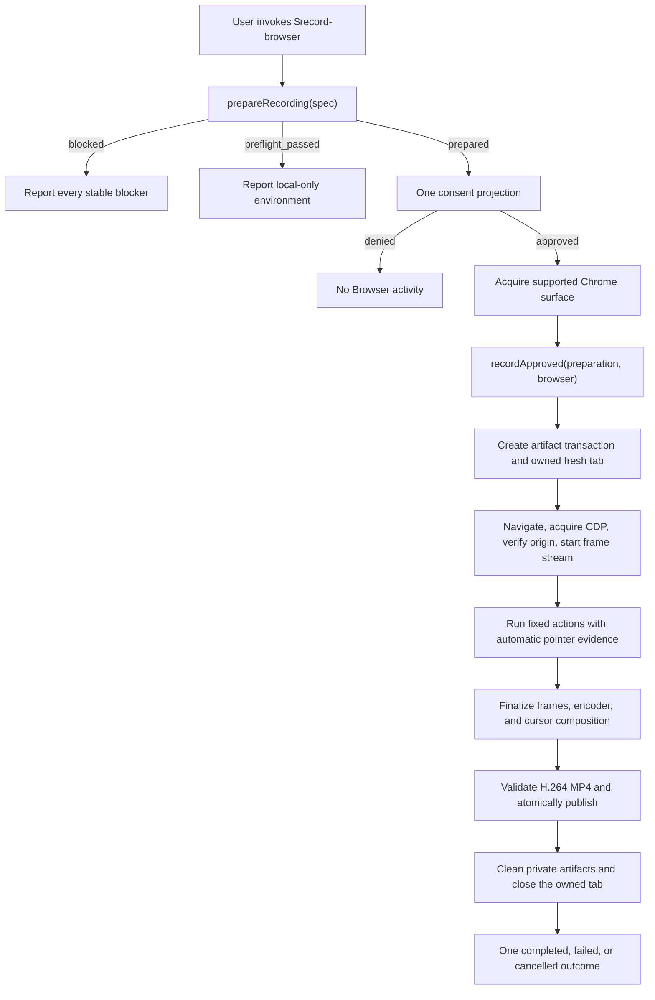

# Architecture

Browser Recorder separates authorization from the recording implementation. The
caller sees one two-phase Recording Flow; Browser, CDP, media, publication, and
cleanup state remain internal.

## System flow

`prepareRecording()` performs request policy, output planning, and local
environment inspection without Browser activity. Its prepared value is opaque,
immutable, bound to one Recording Flow instance, and consumable once. Consent
therefore cannot be followed by a substituted target, action, duration, or
destination. Its `end` projection contains the exact explicit duration or the
action-driven 15-second hard limit.

## External contract

The public module has two operations:

| Operation | Contract |
| --- | --- |
| `prepareRecording(spec)` | Returns `blocked`, `preflight_passed`, or an opaque `prepared` value with a bounded consent projection. Derives pointer requirements from action modality. |
| `recordApproved(prepared, { browser, signal })` | Consumes the exact prepared value once, runs the whole authorized transaction, and resolves one terminal outcome. |

Expected runtime failures resolve as `completed`, `failed`, or `cancelled`.
Failure outcomes contain one allowlisted code, fixed summary and remediation,
plus bounded cleanup state. Callers never coordinate `ready`, `runAction()`,
`finished`, or `stop()`. The fresh tab exists only inside each fixed action
callback and is never exposed as a reusable lifecycle handle; CDP is never
exposed.

The lower-level `createRecording()` handle remains an internal coordinator. It
exists to concentrate timers, action evidence, finalization, and cleanup races;
it is not the skill or caller interface.

## Ownership boundaries

| Layer | Owns | Must not own |
| --- | --- | --- |
| `$record-browser` skill | Request interpretation, concrete action functions, one consent, Chrome acquisition, outcome reporting | Tab lifecycle, CDP, stop ordering, direct cleanup |
| Recording Flow | Request/output preparation, opaque authorization, action sequence, single terminal outcome | New actions after consent, raw diagnostics |
| Internal coordinator | Artifact and fresh-tab ownership, timers, per-action evidence, finalization, memoized close | User-visible policy expansion |
| Browser recording | CDP acquisition, origin checks, direct screencast-frame consumption, frame/resource limits | Publication and public error wording |
| Cursor recording | Pointer observation, frame-coordinate mapping, cursor and click-feedback composition | Authenticating whether an event came from a person |
| Artifact transaction | Private Working Recording, validation, collision-safe publication, rollback | Upload, sharing, playback, or deletion after delivery |

## Browser capture contract

Chrome is the supported recording surface for this release. IAB is rejected by
preparation with `browser_surface_unsupported`; the recorder never probes one
surface and silently falls back to another.

The production capture path consumes the JPEG bytes delivered in
`Page.screencastFrame.params.data`. Each valid frame is acknowledged once and
then passed directly to the bounded encoder sink. It does not issue a separate
`Page.captureScreenshot` request for every event. Readiness requires a valid
first streamed frame within five seconds; no frame fails closed as
`frame_stream_unavailable`. The encoder writes its first accepted frame eagerly,
so an immediately completed action cannot finalize a zero-sample stream.

The frame pump drains ordered navigation, visibility, and frame events. It
identifies the top frame by the absence of a parent rather than a persistent
frame ID, drains navigation policy events already in flight when stopping, and
reverifies the current top-level origin before successful finalization. A
top-level navigation outside the approved origin is terminal. Invalid and
oversized frames are bounded, encoder backpressure cannot create an unbounded
queue, and a fixed 10 fps encoder may repeat the latest valid frame on a static
page.

## Lifecycle invariants

1. Plan output and validate target, duration, surface, action modality, and
   local media requirements before Browser activity.
2. Fix the prepared actions and consent projection before asking for approval.
3. Create exactly one fresh Chrome tab only after approval.
4. Navigate, acquire CDP, verify the approved top-level origin, and require the
   first valid frame before performing an action.
5. Run actions sequentially. Every pointer action automatically requires fresh
   observed evidence after its action boundary. Action-driven pointer plans keep
   a 200 ms visual tail after their final action.
6. For action-driven plans, finalize immediately after the last action. For an
   explicit duration, keep that duration authoritative from capture readiness.
7. Stop frame delivery, screencast, cursor capture, and encoder before cursor
   composition and media validation.
8. Publish only one validated H.264 `yuv420p` video stream with no audio, using
   collision-safe atomic publication.
9. Remove private artifacts and close the exact owned tab. Concurrent close
   requests share one promise; one immediate transient rejection is retried,
   while timeouts remain bounded and are reported for manual cleanup.
10. Preserve the primary recording result when cleanup also fails.

The fail-closed invariants are:

- no Browser activity before preparation and consent;
- no IAB recording or automatic browser switch in this release;
- one fresh tab and one normalized approved top-level origin;
- no successful pointer flow without per-action evidence;
- no Saved Recording before media validation and atomic publication;
- no raw frames, page text, full URLs, CDP payloads, or FFmpeg output in public
  outcomes;
- no automatic upload, sharing, playback, or deletion of a Saved Recording.

## Source-of-truth map

| Concern | Canonical source | Primary tests |
| --- | --- | --- |
| External two-phase flow and outcome | [`record-browser-flow.mjs`](../plugins/codex-browser-recorder/skills/record-browser/scripts/record-browser-flow.mjs) | [`record-browser-flow.test.mjs`](../tests/record-browser-flow.test.mjs) |
| Request policy and media limits | [`recording-policy.mjs`](../plugins/codex-browser-recorder/skills/record-browser/scripts/recording-policy.mjs) | [`recording-policy.test.mjs`](../tests/recording-policy.test.mjs) |
| Local preflight | [`doctor.mjs`](../plugins/codex-browser-recorder/skills/record-browser/scripts/doctor.mjs) | [`doctor.test.mjs`](../tests/doctor.test.mjs) |
| Internal session and owned-tab lifecycle | [`create-recording.mjs`](../plugins/codex-browser-recorder/skills/record-browser/scripts/create-recording.mjs) | [`create-recording.test.mjs`](../tests/create-recording.test.mjs) |
| Browser/CDP capture and origin enforcement | [`browser-recording.mjs`](../plugins/codex-browser-recorder/skills/record-browser/scripts/browser-recording.mjs) | [`browser-recording.test.mjs`](../tests/browser-recording.test.mjs) |
| Frame parsing, pumping, and encoding | [`media-recorder.mjs`](../plugins/codex-browser-recorder/skills/record-browser/scripts/media-recorder.mjs) | [`media-recorder.test.mjs`](../tests/media-recorder.test.mjs) |
| Cursor evidence and composition | [`cursor-recording.mjs`](../plugins/codex-browser-recorder/skills/record-browser/scripts/cursor-recording.mjs) | [`cursor-recording.test.mjs`](../tests/cursor-recording.test.mjs) |
| Artifact publication and rollback | [`recording-artifacts.mjs`](../plugins/codex-browser-recorder/skills/record-browser/scripts/recording-artifacts.mjs) | [`recording-artifacts.test.mjs`](../tests/recording-artifacts.test.mjs) |
| Failure catalog and bounded results | [`recording-outcome.mjs`](../plugins/codex-browser-recorder/skills/record-browser/scripts/recording-outcome.mjs) | [`recording-outcome.test.mjs`](../tests/recording-outcome.test.mjs) |
| Media verification | [`validate-video.mjs`](../plugins/codex-browser-recorder/skills/record-browser/scripts/validate-video.mjs) | [`validate-video.test.mjs`](../tests/validate-video.test.mjs) |
| Agent workflow | [`SKILL.md`](../plugins/codex-browser-recorder/skills/record-browser/SKILL.md) | [`skill-contract.test.mjs`](../tests/skill-contract.test.mjs) |

When documentation and implementation disagree, change them and their tests
together. Historical behavior belongs only in [CHANGELOG.md](../CHANGELOG.md).
