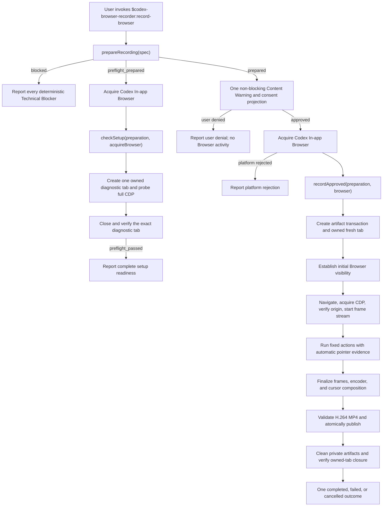

# Architecture

Browser Recorder separates setup readiness and authorization from the recording
implementation. The caller sees one setup-check path and one two-phase Recording
Flow; Browser, CDP, media, publication, and cleanup state remain internal.

## System flow

```mermaid
flowchart TD
  U["User invokes $codex-browser-recorder:record-browser"] --> P["prepareRecording(spec)"]
  P -->|"blocked"| F["Report every deterministic Technical Blocker"]
  P -->|"preflight_prepared"| Q["Acquire Codex In-app Browser"]
  Q --> D["checkSetup(preparation, acquireBrowser)"]
  D --> I["Create one owned diagnostic tab and probe full CDP"]
  I --> J["Close and verify the exact diagnostic tab"]
  J -->|"preflight_passed"| L["Report complete setup readiness"]
  P -->|"prepared"| C["One non-blocking Content Warning and consent projection"]
  C -->|"user denied"| N["Report user denial; no Browser activity"]
  C -->|"approved"| B["Acquire Codex In-app Browser"]
  B -->|"platform rejected"| K["Report platform rejection"]
  B --> R["recordApproved(preparation, browser)"]
  R --> T["Create artifact transaction and owned fresh tab"]
  T --> W["Establish initial Browser visibility"]
  W --> S["Navigate, acquire CDP, verify origin, start frame stream"]
  S --> A["Run fixed actions with automatic pointer evidence"]
  A --> M["Finalize frames, encoder, and cursor composition"]
  M --> V["Validate H.264 MP4 and atomically publish"]
  V --> X["Clean private artifacts and verify owned-tab closure"]
  X --> O["One completed, failed, or cancelled outcome"]
```

`prepareRecording()` performs request policy, output planning, and local
environment inspection without Browser activity. Its prepared value is opaque,
immutable, bound to one Recording Flow instance, and consumable once.
`checkSetup()` consumes only a `preflight_prepared` value and performs a bounded
Codex In-app Browser and full-CDP probe without starting the media pipeline.
Recording consent therefore cannot be followed by a substituted target, action,
duration, or destination. Its `end` projection contains the exact explicit
duration or the action-driven 15-second hard limit. Its Content Warning states
that the complete approved page viewport may contain private, authenticated, or
sensitive content and assigns authorization and downstream local-file handling
to the user.

Browser Recorder is content-neutral. It does not classify page content, redact
visible fields, or refuse a technically valid flow based on authentication,
privacy, or sensitivity. User denial happens before Browser activity; a Codex
or Browser permission denial after authorization is a platform rejection;
deterministic Technical Blockers remain reserved for conditions that prevent a
complete, valid recording.

## External contract

The public module has three operations:

| Operation | Contract |
| --- | --- |
| `prepareRecording(spec)` | Returns `blocked`, an opaque `preflight_prepared` setup value, or an opaque `prepared` value with a bounded consent projection. Derives pointer requirements from action modality. |
| `checkSetup(prepared, { acquireBrowser, signal })` | Consumes the exact setup value once, bounds Codex In-app Browser acquisition and CDP probing, verifies cleanup of its exact fresh diagnostic tab, and returns `preflight_passed` or stable Technical Blockers. It never starts recording or creates media. |
| `recordApproved(prepared, { browser, signal })` | Consumes the exact prepared value once, runs the whole authorized transaction, and resolves one terminal outcome. |

Expected setup failures resolve as `blocked`; expected recording failures
resolve as `failed` or `cancelled`. Blockers and failure outcomes contain
allowlisted codes with fixed summaries and remediation, plus bounded cleanup
state where applicable. Callers never coordinate `ready`, `runAction()`,
`finished`, or `stop()`. Fresh tabs and CDP are never exposed as reusable
lifecycle handles.

The lower-level `createRecording()` handle remains an internal coordinator. It
exists to concentrate timers, action evidence, finalization, and cleanup races;
it is not the skill or caller interface.

## Ownership boundaries

| Layer | Owns | Must not own |
| --- | --- | --- |
| `$codex-browser-recorder:record-browser` skill | Request interpretation, concrete action functions, one consent, bounded Codex In-app Browser acquisition callback, outcome reporting | Tab lifecycle, CDP, stop ordering, direct cleanup |
| Recording Flow | Request/output preparation, setup diagnostic-tab ownership, opaque authorization, action sequence, terminal outcomes | New actions after consent, raw diagnostics |
| Internal coordinator | Artifact and fresh-tab ownership, initial Browser visibility, timers, per-action evidence, finalization, memoized verified tab cleanup | User-visible policy expansion |
| Browser recording | Exact 6-parameter production interface, CDP acquisition, origin checks, direct screencast-frame consumption, and an internal limits/adapters seam | Publication and public error wording |
| Cursor recording | Pointer observation, frame-coordinate mapping, cursor and click-feedback composition | Authenticating whether an event came from a person |
| Artifact transaction | Private Working Recording, validation, collision-safe publication, rollback | Upload, sharing, playback, or deletion after delivery |

## Browser capture contract

The Codex In-app Browser is the only Recording Surface. Preparation rejects a
caller-provided surface selector, and the recorder never probes or switches to
another Browser.

Browser visibility is an approved presentation mode, not a capture correctness
dependency. Interactive Recording is the default and establishes a visible
Browser; Unattended Recording must be explicit and establishes a hidden Browser
for automated QA. After approval, the internal coordinator creates the owned
fresh tab, establishes and verifies the selected state within five seconds, and
only then navigates to the approved target. The modes never silently fall back
to one another. A missing, rejected, malformed, unverifiable, or timed-out
visibility capability fails with `browser_visibility_unavailable` and uses the
normal artifact rollback and exact-tab cleanup path.

The production capture path consumes the JPEG bytes delivered in
`Page.screencastFrame.params.data`. Each valid frame is acknowledged once and
then passed directly to the bounded encoder sink. It does not issue a separate
`Page.captureScreenshot` request for every event. Readiness requires a valid
first streamed frame within five seconds; no frame fails closed as
`frame_stream_unavailable`. The encoder writes its first accepted frame eagerly,
so an immediately completed action cannot finalize a zero-sample stream.

The frame pump drains ordered navigation, visibility, and frame events. It
identifies the top frame by the absence of a parent rather than a persistent
frame ID, drains navigation policy events already in flight when stopping, and
reverifies the current top-level origin before successful finalization. A
top-level navigation outside the approved origin is terminal. Invalid and
oversized frames are bounded, encoder backpressure cannot create an unbounded
queue, and a fixed 10 fps encoder may repeat the latest valid frame on a static
page. Hiding the Browser or moving focus to another Codex view changes only the
bounded `visibilityState` and `visibilityChanges` diagnostics; neither event
gates frame acknowledgement, actions, encoding, validation, publication, or
cleanup.

## Lifecycle invariants

1. Plan output and validate local media requirements before all Browser
   activity; validate target, duration, and action modality before recording
   consent.
2. For an explicit setup request, acquire only the Codex In-app Browser, create
   at most one fresh diagnostic tab, probe full CDP without starting capture,
   and verify that the exact owned tab is closed.
3. Fix prepared recording actions and the non-blocking Content Warning and
   consent projection before asking for recording approval.
4. For a recording, acquire the Codex In-app Browser and create exactly one
   fresh owned tab only after approval. Establish and verify the approved
   Interactive or Unattended visibility mode before navigating; bound failure
   and use normal cleanup.
5. Navigate, acquire CDP, verify the approved top-level origin, and require the
   first valid frame before performing an action. Later visibility and focus
   changes do not affect the healthy Recording Session lifecycle.
6. Run actions sequentially. Every pointer action automatically requires fresh
   observed evidence after its action boundary. Action-driven pointer plans keep
   a 200 ms visual tail after their final action. Embedded-frame release
   qualification additionally requires the child-frame pointer-event counter to
   increase across its exact production action boundary.
7. For action-driven plans, finalize immediately after the last action. For an
   explicit duration, keep that duration authoritative from capture readiness.
8. Stop frame delivery, screencast, cursor capture, and encoder before cursor
   composition and media validation.
9. Publish only one validated H.264 `yuv420p` video stream with no audio, using
   collision-safe atomic publication.
10. Remove private artifacts and close the exact owned tab. Concurrent close
   requests share one promise, and successful closure requires the exact tab to
   disappear from the Browser tab inventory. One shared retry covers an
   immediate close rejection, inventory failure, or still-listed tab; timeouts
   remain bounded and are reported for manual cleanup.
11. Preserve the primary recording or setup result when cleanup also fails.

The fail-closed invariants are:

- no Browser activity before local preparation;
- no recording Browser activity before consent;
- no setup recording artifact, raw frame dump, or upload;
- no alternate Recording Surface or automatic Browser switch;
- no recording navigation or approved action before the approved Browser
  visibility mode is established and verified;
- one fresh tab and one normalized approved top-level origin;
- no successful pointer flow without per-action evidence;
- no Saved Recording before media validation and atomic publication;
- no raw frames, page text, full URLs, CDP payloads, or FFmpeg output in public
  outcomes;
- no automatic upload, sharing, playback, or deletion of a Saved Recording.

## Source-of-truth map

| Concern | Canonical source | Primary tests |
| --- | --- | --- |
| External setup, two-phase recording flow, and outcomes | [`record-browser-flow.mjs`](../plugins/codex-browser-recorder/skills/record-browser/scripts/record-browser-flow.mjs) | [`record-browser-flow.test.mjs`](../tests/record-browser-flow.test.mjs) |
| Request policy and media limits | [`recording-policy.mjs`](../plugins/codex-browser-recorder/skills/record-browser/scripts/recording-policy.mjs) | [`recording-policy.test.mjs`](../tests/recording-policy.test.mjs) |
| Local environment inspection | [`doctor.mjs`](../plugins/codex-browser-recorder/skills/record-browser/scripts/doctor.mjs) | [`doctor.test.mjs`](../tests/doctor.test.mjs) |
| Internal session and owned-tab lifecycle | [`create-recording.mjs`](../plugins/codex-browser-recorder/skills/record-browser/scripts/create-recording.mjs) | [`create-recording.test.mjs`](../tests/create-recording.test.mjs) |
| Browser/CDP capture and origin enforcement | [`browser-recording.mjs`](../plugins/codex-browser-recorder/skills/record-browser/scripts/browser-recording.mjs) | [`browser-recording.test.mjs`](../tests/browser-recording.test.mjs) |
| Frame parsing, pumping, and encoding | [`media-recorder.mjs`](../plugins/codex-browser-recorder/skills/record-browser/scripts/media-recorder.mjs) | [`media-recorder.test.mjs`](../tests/media-recorder.test.mjs) |
| Cursor evidence and composition | [`cursor-recording.mjs`](../plugins/codex-browser-recorder/skills/record-browser/scripts/cursor-recording.mjs) | [`cursor-recording.test.mjs`](../tests/cursor-recording.test.mjs) |
| Artifact publication and rollback | [`recording-artifacts.mjs`](../plugins/codex-browser-recorder/skills/record-browser/scripts/recording-artifacts.mjs) | [`recording-artifacts.test.mjs`](../tests/recording-artifacts.test.mjs) |
| Failure catalog and bounded results | [`recording-outcome.mjs`](../plugins/codex-browser-recorder/skills/record-browser/scripts/recording-outcome.mjs) | [`recording-outcome.test.mjs`](../tests/recording-outcome.test.mjs) |
| Media verification | [`validate-video.mjs`](../plugins/codex-browser-recorder/skills/record-browser/scripts/validate-video.mjs) | [`validate-video.test.mjs`](../tests/validate-video.test.mjs) |
| Agent workflow | [`SKILL.md`](../plugins/codex-browser-recorder/skills/record-browser/SKILL.md) | [`skill-contract.test.mjs`](../tests/skill-contract.test.mjs) |
| Real Browser release qualification and bounded action evidence | [`codex-in-app-browser-release-gate.mjs`](../scripts/codex-in-app-browser-release-gate.mjs), [`codex-in-app-browser-release-evidence.mjs`](../scripts/codex-in-app-browser-release-evidence.mjs) | [`codex-in-app-browser-release-gate.test.mjs`](../tests/codex-in-app-browser-release-gate.test.mjs) |
| Qualification fixtures, flow wiring, and the visibility preflight | [`codex-in-app-browser-release-qualification.mjs`](../scripts/codex-in-app-browser-release-qualification.mjs) | [`codex-in-app-browser-release-qualification.test.mjs`](../tests/codex-in-app-browser-release-qualification.test.mjs) |
| Low-level CDP frame diagnostic | [`codex-in-app-browser-frame-diagnostic.mjs`](../scripts/codex-in-app-browser-frame-diagnostic.mjs) | [`codex-in-app-browser-frame-diagnostic.test.mjs`](../tests/codex-in-app-browser-frame-diagnostic.test.mjs) |

When documentation and implementation disagree, change them and their tests
together. Historical behavior belongs only in [CHANGELOG.md](../CHANGELOG.md).
