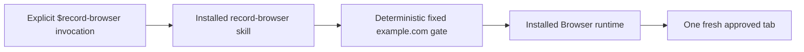

# Phase 2 Deterministic Runtime Hardening Implementation Plan

> **For agentic workers:** REQUIRED SUB-SKILL: Use superpowers:subagent-driven-development (recommended) or superpowers:executing-plans to implement this plan task-by-task. Steps use checkbox (`- [ ]`) syntax for tracking.

**Goal:** Make the fixed `https://example.com/` recording gate enforce its approved origin, runtime duration, singleton lifecycle, startup cleanup, media capabilities, and diagnostic boundary in deterministic code before community release work begins.

**Architecture:** Keep the plugin skills-only. Add a focused `example-recording-gate.mjs` policy wrapper around the existing generic recording adapter, verify the top-level page URL through the same reacquired CDP capability immediately before screencast startup, and keep Browser tab creation and user-visible consent in the skill. Harden startup as a cleanup transaction, make FFmpeg capability detection feature-based, and remove encoder stderr from observable Error objects.

**Tech Stack:** Node.js 24 built-ins, `node:test`, Codex Browser tab-scoped CDP, FFmpeg/FFprobe, VP8 WebM, official Codex plugin and Agent Skills validators.

## Global Constraints

- Continue on the existing checkout; do not create a worktree unless the user changes the repository workflow.
- Keep invocation explicit through `$record-browser`; `policy.allow_implicit_invocation` remains `false`.
- The only allowed page is exactly `https://example.com/`; reject redirects, query strings, fragments, sibling origins, and every other URL before `Page.startScreencast`.
- The user-visible recording interval remains 10–15 seconds; deterministic runtime policy stops the session no later than 20,000 ms.
- Keep 10 fps, JPEG quality 70, maximum dimensions 1280×720, maximum decoded frame size 5 MiB, and maximum output size 500 MiB.
- Keep output local, temporary, audio-free, VP8, and WebM. Do not add upload, sharing, telemetry, audio, browser chrome, other-tab capture, or profile access.
- Preserve normal Browser site and full-CDP approvals. Denial maps to `cancelled`; never retry or bypass it.
- Do not add an MCP server, app, hook, separate browser process, or remote service in this phase.
- Do not change GitHub settings, publish tags/releases, push commits, or prepare public-directory legal/brand assets in this phase; those belong to a separate community release operations plan.
- Treat full URLs, CDP payloads, frames, page text, absolute plugin-cache paths, subprocess output, and credentials as non-reportable runtime data.
- Preserve the generic `createBrowserRecording()` adapter for internal composition and tests; the installed skill must use the new fixed-policy `createExampleRecording()` entry point.
- Use TDD for every behavior change and commit each independently reviewable task.

---

## File Structure

- Create `plugins/codex-browser-recorder/skills/record-browser/scripts/example-recording-gate.mjs` as the only owner of fixed-origin policy, fixed resource constants, and the process-wide active recording key.
- Create `tests/example-recording-gate.test.mjs` for fixed-policy and singleton lifecycle behavior.
- Modify `plugins/codex-browser-recorder/skills/record-browser/scripts/run-browser-recording.mjs` only for same-session URL verification and startup transaction cleanup.
- Modify `plugins/codex-browser-recorder/skills/record-browser/scripts/doctor.mjs` only for executable resolution and bounded media feature probes.
- Modify `plugins/codex-browser-recorder/skills/record-browser/scripts/screencast-recorder.mjs` only to close the stderr disclosure path.
- Modify existing focused tests next to the production modules they cover; do not create a second test framework.
- Modify `plugins/codex-browser-recorder/skills/record-browser/SKILL.md` to orchestrate the fixed wrapper instead of reproducing lifecycle policy in model-executed JavaScript.
- Modify `README.md` and the Phase 1 integration design only where the observable contract changes.

### Task 1: Enforce the exact top-level URL in the recording CDP session

**Files:**
- Modify: `plugins/codex-browser-recorder/skills/record-browser/scripts/run-browser-recording.mjs:59-72`
- Modify: `plugins/codex-browser-recorder/skills/record-browser/scripts/run-browser-recording.mjs:509-569`
- Test: `tests/browser-poc-result.test.mjs:312-405`

**Interfaces:**
- Consumes: `CdpTabCapability.send(method, params?, options?)` and the expected string URL.
- Produces: `assertTopLevelUrl({ cdp, expectedUrl }): Promise<true>`.
- Produces: `startBrowserPocForTab({ expectedTopLevelUrl, tab, ...recordingOptions })` that validates through the same reacquired `cdp` object immediately before calling `startBrowserPoc()`.
- Stable failures: `origin_not_allowed`, `origin_verification_failed`, and existing `invalid_configuration`.

- [ ] **Step 1: Write failing exact-URL tests**

Add `assertTopLevelUrl` to the import from `run-browser-recording.mjs`, then add these tests to `tests/browser-poc-result.test.mjs`:

```js
test("accepts only the exact approved top-level URL", async () => {
  const methods = [];
  const cdp = {
    async send(method) {
      methods.push(method);
      return {
        frameTree: { frame: { url: "https://example.com/" } },
      };
    },
  };

  assert.equal(
    await assertTopLevelUrl({
      cdp,
      expectedUrl: "https://example.com/",
    }),
    true,
  );
  assert.deepEqual(methods, ["Page.getFrameTree"]);
});

test("rejects a different URL without exposing it", async () => {
  const secretUrl = "https://example.com/?token=must-not-leak";
  const cdp = {
    async send() {
      return { frameTree: { frame: { url: secretUrl } } };
    },
  };

  await assert.rejects(
    assertTopLevelUrl({ cdp, expectedUrl: "https://example.com/" }),
    (error) =>
      error.code === "origin_not_allowed" &&
      !error.message.includes(secretUrl) &&
      !JSON.stringify(error).includes(secretUrl),
  );
});

test("maps missing or failed frame-tree inspection to a stable error", async () => {
  for (const send of [
    async () => ({}),
    async () => {
      throw new Error("raw CDP diagnostic");
    },
  ]) {
    await assert.rejects(
      assertTopLevelUrl({
        cdp: { send },
        expectedUrl: "https://example.com/",
      }),
      (error) =>
        error.code === "origin_verification_failed" &&
        !error.message.includes("raw CDP diagnostic"),
    );
  }
});
```

Update the existing `acquires a fresh CDP capability for every recording session` fake so `send(method)` returns a frame tree for `Page.getFrameTree`, records command order, and passes `expectedTopLevelUrl: "https://example.com/"` into `startBrowserPocForTab()`.

- [ ] **Step 2: Run the focused test and verify RED**

Run:

```bash
node --test tests/browser-poc-result.test.mjs
```

Expected: FAIL because `assertTopLevelUrl` is not exported and `startBrowserPocForTab` does not inspect the top-level frame.

- [ ] **Step 3: Implement bounded same-session URL verification**

Add both new failure codes to `CAPTURE_FAILURE_CODES`, then add this function before `startBrowserPocForTab`:

```js
export async function assertTopLevelUrl({ cdp, expectedUrl }) {
  if (
    typeof cdp?.send !== "function" ||
    typeof expectedUrl !== "string" ||
    expectedUrl.length === 0
  ) {
    throw new PocError(
      "invalid_configuration",
      "Top-level URL verification configuration is invalid",
    );
  }

  let frameTree;
  try {
    frameTree = await cdp.send("Page.getFrameTree");
  } catch {
    throw new PocError(
      "origin_verification_failed",
      "The recording page origin could not be verified",
    );
  }

  const actualUrl = frameTree?.frameTree?.frame?.url;
  if (typeof actualUrl !== "string") {
    throw new PocError(
      "origin_verification_failed",
      "The recording page origin could not be verified",
    );
  }
  if (actualUrl !== expectedUrl) {
    throw new PocError(
      "origin_not_allowed",
      "The recording page is outside the approved fixed origin",
    );
  }
  return true;
}
```

Change the tab adapter to verify after capability acquisition and before starting the screencast:

```js
export async function startBrowserPocForTab({
  expectedTopLevelUrl,
  tab,
  ...options
}) {
  if (typeof tab?.capabilities?.get !== "function") {
    throw new PocError(
      "cdp_unavailable",
      "The selected Browser tab does not expose capabilities",
    );
  }

  const cdp = await tab.capabilities.get("cdp");
  if (
    typeof cdp?.readEvents !== "function" ||
    typeof cdp?.send !== "function"
  ) {
    throw new PocError(
      "cdp_unavailable",
      "Full CDP access is unavailable for the selected Browser tab",
    );
  }

  if (expectedTopLevelUrl !== undefined) {
    await assertTopLevelUrl({ cdp, expectedUrl: expectedTopLevelUrl });
  }
  return startBrowserPoc({ ...options, cdp });
}
```

Add `expectedTopLevelUrl` to `createBrowserRecording()` and pass it to `startBrowserPocForTab()` without returning it through `status()` or the result schema.

- [ ] **Step 4: Run focused and regression tests**

Run:

```bash
node --test tests/browser-poc-result.test.mjs tests/browser-recording-adapter.test.mjs
npm run check
git diff --check
```

Expected: all tests PASS; command order shows `Page.getFrameTree` before `Page.enable` and `Page.startScreencast`; no error or status contains the rejected URL.

- [ ] **Step 5: Commit the exact-origin boundary**

```bash
git add plugins/codex-browser-recorder/skills/record-browser/scripts/run-browser-recording.mjs tests/browser-poc-result.test.mjs
git commit -m "feat: enforce the fixed recording origin"
```

### Task 2: Clean prepared artifacts when session startup fails

**Files:**
- Modify: `plugins/codex-browser-recorder/skills/record-browser/scripts/run-browser-recording.mjs:1-24`
- Modify: `plugins/codex-browser-recorder/skills/record-browser/scripts/run-browser-recording.mjs:531-570`
- Test: `tests/browser-recording-adapter.test.mjs:33-124`
- Test: `tests/browser-poc-result.test.mjs:64-77`

**Interfaces:**
- Consumes: the `{ directory, outputPath, resultPath }` object returned by `prepareBrowserPoc()`.
- Produces: `cleanupPreparedBrowserPoc(paths): Promise<void>`.
- Guarantees: if `startBrowserPocForTab()` throws before a session handle exists, the unique directory is removed and the original startup error remains the observed error.

- [ ] **Step 1: Write failing cleanup tests**

Add this filesystem test to `tests/browser-poc-result.test.mjs`:

```js
test("removes a prepared recording directory as one cleanup unit", async () => {
  const temporaryRoot = mkdtempSync(join(tmpdir(), "browser-recorder-cleanup-"));
  try {
    const paths = await prepareBrowserPoc({ temporaryRoot });
    writeFileSync(`${paths.outputPath}.partial`, "partial");

    await cleanupPreparedBrowserPoc(paths);

    assert.equal(existsSync(paths.directory), false);
  } finally {
    rmSync(temporaryRoot, { force: true, recursive: true });
  }
});
```

Extend the adapter harness with `cleanup` and `startError` counters/state, then add:

```js
test("cleans the prepared directory when session startup fails", async () => {
  const startupError = Object.assign(new Error("CDP startup failed"), {
    code: "cdp_unavailable",
  });
  const harness = createHarness({ startError: startupError });

  await assert.rejects(createHandle(harness), (error) => error === startupError);

  assert.equal(harness.calls.prepare, 1);
  assert.equal(harness.calls.start, 1);
  assert.equal(harness.calls.cleanup, 1);
  assert.equal(harness.calls.finalize, 0);
});

test("preserves the startup error when directory cleanup also fails", async () => {
  const startupError = Object.assign(new Error("Primary startup failure"), {
    code: "cdp_unavailable",
  });
  const harness = createHarness({
    cleanupError: new Error("private cleanup diagnostic"),
    startError: startupError,
  });

  await assert.rejects(createHandle(harness), (error) => error === startupError);
  assert.equal(harness.calls.cleanup, 1);
});
```

- [ ] **Step 2: Run tests and verify RED**

Run:

```bash
node --test tests/browser-recording-adapter.test.mjs tests/browser-poc-result.test.mjs
```

Expected: FAIL because `cleanupPreparedBrowserPoc` and startup rollback do not exist.

- [ ] **Step 3: Implement the startup transaction rollback**

Import `rm` from `node:fs/promises`, then add:

```js
export async function cleanupPreparedBrowserPoc(paths) {
  if (
    typeof paths?.directory !== "string" ||
    paths.directory.length === 0
  ) {
    throw new PocError(
      "invalid_configuration",
      "Prepared recording paths are invalid",
    );
  }
  await rm(paths.directory, { force: true, recursive: true });
}
```

Add `cleanupPreparedBrowserPoc` to the default `_dependencies`, and wrap session creation:

```js
const paths = await _dependencies.prepareBrowserPoc({ temporaryRoot });
let session;
try {
  session = await _dependencies.startBrowserPocForTab({
    expectedTopLevelUrl,
    ffmpegPath,
    firstFrameTimeoutMs,
    fps,
    maxDecodedBytes,
    maxDurationMs,
    maxFrameStallMs,
    maxOutputBytes,
    outputPath: paths.outputPath,
    readTimeoutMs,
    resourceCheckIntervalMs,
    signal,
    tab,
  });
} catch (error) {
  try {
    await _dependencies.cleanupPreparedBrowserPoc(paths);
  } catch {
    // Preserve the bounded startup failure as the primary error.
  }
  throw error;
}
```

Update the test harness dependency object so its cleanup function increments `calls.cleanup`, receives the exact prepared paths, and optionally throws `cleanupError`.

- [ ] **Step 4: Run focused and full tests**

Run:

```bash
node --test tests/browser-recording-adapter.test.mjs tests/browser-poc-result.test.mjs
npm run check
git diff --check
```

Expected: all tests PASS and no prepared directory survives a pre-handle startup failure.

- [ ] **Step 5: Commit startup cleanup**

```bash
git add plugins/codex-browser-recorder/skills/record-browser/scripts/run-browser-recording.mjs tests/browser-recording-adapter.test.mjs tests/browser-poc-result.test.mjs
git commit -m "fix: clean failed recording startup"
```

### Task 3: Add the fixed-policy example recording entry point

**Files:**
- Create: `plugins/codex-browser-recorder/skills/record-browser/scripts/example-recording-gate.mjs`
- Create: `tests/example-recording-gate.test.mjs`
- Modify: `tests/plugin-structure.test.mjs:18-23`

**Interfaces:**
- Consumes: `{ ffmpegPath, ffprobePath, signal?, tab, temporaryRoot? }`.
- Produces: `createExampleRecording(options): Promise<{ ready: Promise<unknown>, status(): object, stop(): Promise<object> }>`.
- Fixed policy: exact URL `https://example.com/`, `maxDurationMs: 20_000`, `fps: 10`, `maxDecodedBytes: 5 * 1024 * 1024`, `maxFrameStallMs: 5_000`, `maxHeight: 720`, `maxWidth: 1280`, and `maxOutputBytes: 500 * 1024 * 1024`.
- Stable failure: `recording_already_active`.

- [ ] **Step 1: Write the failing policy-wrapper tests**

Create `tests/example-recording-gate.test.mjs`:

```js
import assert from "node:assert/strict";
import test from "node:test";

import {
  createExampleRecording,
  EXAMPLE_PAGE_URL,
  EXAMPLE_RECORDING_MAX_DURATION_MS,
} from "../plugins/codex-browser-recorder/skills/record-browser/scripts/example-recording-gate.mjs";

const activeKey = Symbol.for("codex-browser-recorder.active");

function deferred() {
  let reject;
  let resolve;
  const promise = new Promise((resolvePromise, rejectPromise) => {
    reject = rejectPromise;
    resolve = resolvePromise;
  });
  return { promise, reject, resolve };
}

function createHarness({ ready = Promise.resolve() } = {}) {
  const calls = { create: 0, stop: 0 };
  let receivedOptions;
  const inner = {
    ready,
    status() {
      return { capture: {}, state: "recording" };
    },
    async stop() {
      calls.stop += 1;
      return { result: { status: "passed" } };
    },
  };
  return {
    calls,
    dependencies: {
      async createBrowserRecording(options) {
        calls.create += 1;
        receivedOptions = options;
        return inner;
      },
    },
    get receivedOptions() {
      return receivedOptions;
    },
  };
}

test.afterEach(() => {
  delete globalThis[activeKey];
});

test("applies the complete fixed recording policy", async () => {
  const harness = createHarness();
  const tab = { id: "approved-tab" };
  const handle = await createExampleRecording({
    _dependencies: harness.dependencies,
    ffmpegPath: "/usr/local/bin/ffmpeg",
    ffprobePath: "/usr/local/bin/ffprobe",
    tab,
    temporaryRoot: "/private/tmp",
  });

  assert.deepEqual(Object.keys(handle).sort(), ["ready", "status", "stop"]);
  assert.equal(EXAMPLE_PAGE_URL, "https://example.com/");
  assert.equal(EXAMPLE_RECORDING_MAX_DURATION_MS, 20_000);
  assert.deepEqual(harness.receivedOptions, {
    expectedTopLevelUrl: "https://example.com/",
    ffmpegPath: "/usr/local/bin/ffmpeg",
    ffprobePath: "/usr/local/bin/ffprobe",
    fps: 10,
    maxDecodedBytes: 5 * 1024 * 1024,
    maxDurationMs: 20_000,
    maxFrameStallMs: 5_000,
    maxHeight: 720,
    maxOutputBytes: 500 * 1024 * 1024,
    maxWidth: 1280,
    signal: undefined,
    tab,
    temporaryRoot: "/private/tmp",
  });
});

test("rejects a concurrent recording before allocating another session", async () => {
  const harness = createHarness();
  await createExampleRecording({
    _dependencies: harness.dependencies,
    ffmpegPath: "ffmpeg",
    ffprobePath: "ffprobe",
    tab: {},
  });

  await assert.rejects(
    createExampleRecording({
      _dependencies: harness.dependencies,
      ffmpegPath: "ffmpeg",
      ffprobePath: "ffprobe",
      tab: {},
    }),
    (error) => error.code === "recording_already_active",
  );
  assert.equal(harness.calls.create, 1);
});

test("memoizes stop and releases the singleton in a finally path", async () => {
  const harness = createHarness();
  const options = {
    _dependencies: harness.dependencies,
    ffmpegPath: "ffmpeg",
    ffprobePath: "ffprobe",
    tab: {},
  };
  const handle = await createExampleRecording(options);

  const firstStop = handle.stop();
  const secondStop = handle.stop();
  assert.equal(firstStop, secondStop);
  await firstStop;
  assert.equal(harness.calls.stop, 1);

  const next = await createExampleRecording(options);
  await next.stop();
  assert.equal(harness.calls.create, 2);
});

test("automatically stops and releases the singleton after readiness failure", async () => {
  const readiness = deferred();
  const harness = createHarness({ ready: readiness.promise });
  const options = {
    _dependencies: harness.dependencies,
    ffmpegPath: "ffmpeg",
    ffprobePath: "ffprobe",
    tab: {},
  };
  const handle = await createExampleRecording(options);
  const failure = Object.assign(new Error("No frame"), {
    code: "frame_stream_unavailable",
  });

  readiness.reject(failure);
  await assert.rejects(handle.ready, (error) => error === failure);
  await new Promise((resolve) => setImmediate(resolve));
  assert.equal(harness.calls.stop, 1);

  const next = await createExampleRecording(options);
  await next.stop();
});
```

Add `example-recording-gate.mjs` to `requiredScripts` in `tests/plugin-structure.test.mjs`.

- [ ] **Step 2: Run tests and verify RED**

Run:

```bash
node --test tests/example-recording-gate.test.mjs tests/plugin-structure.test.mjs
```

Expected: FAIL because the fixed-policy module does not exist.

- [ ] **Step 3: Implement the fixed-policy wrapper**

Create `example-recording-gate.mjs`:

```js
import { createBrowserRecording } from "./run-browser-recording.mjs";

export const EXAMPLE_PAGE_URL = "https://example.com/";
export const EXAMPLE_RECORDING_MAX_DURATION_MS = 20_000;

const ACTIVE_RECORDING_KEY = Symbol.for("codex-browser-recorder.active");

function recordingAlreadyActiveError() {
  return Object.assign(new Error("A recording is already active"), {
    code: "recording_already_active",
  });
}

export async function createExampleRecording({
  _dependencies = { createBrowserRecording },
  ffmpegPath,
  ffprobePath,
  signal,
  tab,
  temporaryRoot,
}) {
  if (globalThis[ACTIVE_RECORDING_KEY] != null) {
    throw recordingAlreadyActiveError();
  }

  const inner = await _dependencies.createBrowserRecording({
    expectedTopLevelUrl: EXAMPLE_PAGE_URL,
    ffmpegPath,
    ffprobePath,
    fps: 10,
    maxDecodedBytes: 5 * 1024 * 1024,
    maxDurationMs: EXAMPLE_RECORDING_MAX_DURATION_MS,
    maxFrameStallMs: 5_000,
    maxHeight: 720,
    maxOutputBytes: 500 * 1024 * 1024,
    maxWidth: 1280,
    signal,
    tab,
    temporaryRoot,
  });

  let stopPromise = null;
  const handle = {
    ready: inner.ready,
    status() {
      return inner.status();
    },
    stop() {
      stopPromise ??= Promise.resolve()
        .then(() => inner.stop())
        .finally(() => {
          if (globalThis[ACTIVE_RECORDING_KEY] === handle) {
            delete globalThis[ACTIVE_RECORDING_KEY];
          }
        });
      return stopPromise;
    },
  };

  globalThis[ACTIVE_RECORDING_KEY] = handle;
  void Promise.resolve(handle.ready)
    .catch(() => handle.stop())
    .catch(() => {
      // The caller observes readiness and finalization failures separately.
    });
  return handle;
}
```

- [ ] **Step 4: Run focused and full tests**

Run:

```bash
node --test tests/example-recording-gate.test.mjs tests/browser-recording-adapter.test.mjs tests/plugin-structure.test.mjs
npm run check
git diff --check
```

Expected: all tests PASS; fixed policy cannot be overridden by caller options; repeated `stop()` returns one promise; a failed readiness path releases the global singleton.

- [ ] **Step 5: Commit the deterministic gate**

```bash
git add plugins/codex-browser-recorder/skills/record-browser/scripts/example-recording-gate.mjs tests/example-recording-gate.test.mjs tests/plugin-structure.test.mjs
git commit -m "feat: add deterministic example recording gate"
```

### Task 4: Remove FFmpeg stderr from observable errors

**Files:**
- Modify: `plugins/codex-browser-recorder/skills/record-browser/scripts/screencast-recorder.mjs:255-304`
- Modify: `plugins/codex-browser-recorder/skills/record-browser/scripts/screencast-recorder.mjs:403-417`
- Test: `tests/screencast-recorder.test.mjs:467-494`

**Interfaces:**
- Consumes: FFmpeg process exit, signal, and stdin failure state.
- Produces: stable `RecorderError` containing only `name`, `message`, and `code` as observable own fields.
- Security property: subprocess stderr is drained by the process configuration and never attached to the thrown Error, result JSON, status, or model-visible contract.

- [ ] **Step 1: Make the encoder-failure test prove stderr cannot escape**

Change the failing shell fixture and assertion:

```js
writeFileSync(
  failingProcessPath,
  "#!/bin/sh\nfor last do :; done\n: > \"$last\"\nprintf 'sensitive encoder diagnostic\\n' >&2\nexit 7\n",
);

let observedError;
await assert.rejects(sink.stop(), (error) => {
  observedError = error;
  return error.code === "encoder_failed";
});
assert.equal("diagnostic" in observedError, false);
assert.doesNotMatch(
  JSON.stringify(observedError),
  /sensitive encoder diagnostic/,
);
```

- [ ] **Step 2: Run the focused test and verify RED**

Run:

```bash
node --test tests/screencast-recorder.test.mjs
```

Expected: FAIL because the current Error has an enumerable `diagnostic` property containing the stderr tail.

- [ ] **Step 3: Remove stderr capture from the public failure path**

Change the existing FFmpeg spawn call to the following complete form, and remove `stderrTail`, its listener, and `error.diagnostic`:

```js
const child = spawn(
  ffmpegPath,
  [
    "-hide_banner",
    "-loglevel",
    "error",
    "-f",
    "image2pipe",
    "-framerate",
    String(fps),
    "-vcodec",
    "mjpeg",
    "-i",
    "pipe:0",
    "-an",
    "-c:v",
    "libvpx",
    "-deadline",
    "realtime",
    "-cpu-used",
    "5",
    "-pix_fmt",
    "yuv420p",
    "-f",
    "webm",
    "-y",
    workingOutputPath,
  ],
  { stdio: ["pipe", "ignore", "ignore"] },
);
```

Keep the stable error construction:

```js
if (processError !== null || code !== 0 || stdinError !== null) {
  await rm(workingOutputPath, { force: true });
  throw new RecorderError(
    "encoder_failed",
    processError !== null
      ? "FFmpeg could not be started"
      : code !== 0
        ? `FFmpeg exited unsuccessfully (${signal ?? code})`
        : "FFmpeg input stream failed",
  );
}
```

Do not add a logging callback or a replacement diagnostic property in this phase.

- [ ] **Step 4: Run focused and full tests**

Run:

```bash
node --test tests/screencast-recorder.test.mjs tests/browser-poc-result.test.mjs
npm run check
git diff --check
```

Expected: all tests PASS and failure serialization contains no subprocess output.

- [ ] **Step 5: Commit the diagnostic boundary**

```bash
git add plugins/codex-browser-recorder/skills/record-browser/scripts/screencast-recorder.mjs tests/screencast-recorder.test.mjs
git commit -m "fix: keep encoder diagnostics private"
```

### Task 5: Feature-detect the required FFmpeg and FFprobe capabilities

**Files:**
- Modify: `plugins/codex-browser-recorder/skills/record-browser/scripts/doctor.mjs:8-99`
- Modify: `tests/doctor.test.mjs:9-110`

**Interfaces:**
- Consumes: a resolved executable path and bounded, shell-free `execFile` probes.
- Produces: existing doctor fields plus `ffmpegVp8Available`, `ffmpegWebmAvailable`, and `ffprobeUsable` booleans.
- Stable blockers: `ffmpeg_missing`, `ffprobe_missing`, `ffmpeg_vp8_unavailable`, `ffmpeg_webm_unavailable`, and `ffprobe_unusable`.
- Probe limits: 5,000 ms timeout and 1 MiB subprocess output buffer per command; raw probe output is never returned.

- [ ] **Step 1: Replace presence-only fixtures with capability-aware fixtures**

Change the test executables to emit the stable help headers used to identify the required capabilities:

```js
writeFileSync(
  join(binDirectory, "ffmpeg"),
  [
    "#!/bin/sh",
    "case \"$*\" in",
    "  *\"encoder=libvpx\"*) printf 'Encoder libvpx [libvpx VP8]:\\n' ;;",
    "  *\"muxer=webm\"*) printf 'Muxer webm [WebM]:\\n' ;;",
    "  *) printf 'ffmpeg version test\\n' ;;",
    "esac",
  ].join("\n"),
);
writeFileSync(
  join(binDirectory, "ffprobe"),
  "#!/bin/sh\nprintf 'ffprobe version test\\n'\n",
);
chmodSync(join(binDirectory, "ffmpeg"), 0o755);
chmodSync(join(binDirectory, "ffprobe"), 0o755);
```

Extend the supported assertion:

```js
assert.equal(result.ffmpegVp8Available, true);
assert.equal(result.ffmpegWebmAvailable, true);
assert.equal(result.ffprobeUsable, true);
```

Update `supports the Browser runtime when global process metadata is unavailable` so it remains hermetic:

```js
probeMediaCapabilities: async () => ({
  ffmpegVp8Available: true,
  ffmpegWebmAvailable: true,
  ffprobeUsable: true,
}),
resolveExecutableByName: async (name) => name,
```

Add three table-driven negative cases using executable scripts that return exit code 0 but omit exactly one required signature:

```js
for (const variant of [
  {
    code: "ffmpeg_vp8_unavailable",
    ffmpegVp8Available: false,
    ffmpegWebmAvailable: true,
    ffprobeUsable: true,
  },
  {
    code: "ffmpeg_webm_unavailable",
    ffmpegVp8Available: true,
    ffmpegWebmAvailable: false,
    ffprobeUsable: true,
  },
  {
    code: "ffprobe_unusable",
    ffmpegVp8Available: true,
    ffmpegWebmAvailable: true,
    ffprobeUsable: false,
  },
]) {
  test(`reports ${variant.code} without returning probe output`, async () => {
    const result = await doctor({
      cdpAvailable: true,
      outputDirectory,
      pathValue: binDirectory,
      platform: "darwin",
      probeMediaCapabilities: async () => ({
        ffmpegVp8Available: variant.ffmpegVp8Available,
        ffmpegWebmAvailable: variant.ffmpegWebmAvailable,
        ffprobeUsable: variant.ffprobeUsable,
      }),
    });

    assert.equal(result.supported, false);
    assert.deepEqual(result.blockingReasons, [variant.code]);
    assert.doesNotMatch(JSON.stringify(result), /Encoder libvpx|Muxer webm/);
  });
}
```

- [ ] **Step 2: Run doctor tests and verify RED**

Run:

```bash
node --test tests/doctor.test.mjs
```

Expected: FAIL because the doctor does not return capability booleans or feature-specific blockers.

- [ ] **Step 3: Implement bounded feature probes**

Add this production probe:

```js
async function commandMatches(executable, arguments_, pattern) {
  try {
    const { stdout } = await execFileAsync(executable, arguments_, {
      encoding: "utf8",
      maxBuffer: 1024 * 1024,
      timeout: 5000,
      windowsHide: true,
    });
    return pattern.test(stdout);
  } catch {
    return false;
  }
}

async function inspectMediaCapabilities(ffmpegPath, ffprobePath) {
  const [ffmpegVp8Available, ffmpegWebmAvailable, ffprobeUsable] =
    await Promise.all([
      ffmpegPath === null
        ? false
        : commandMatches(
            ffmpegPath,
            ["-hide_banner", "-loglevel", "error", "-h", "encoder=libvpx"],
            /^Encoder libvpx \[/m,
          ),
      ffmpegPath === null
        ? false
        : commandMatches(
            ffmpegPath,
            ["-hide_banner", "-loglevel", "error", "-h", "muxer=webm"],
            /^Muxer webm \[/m,
          ),
      ffprobePath === null
        ? false
        : commandMatches(
            ffprobePath,
            ["-version"],
            /^ffprobe version /m,
          ),
    ]);
  return { ffmpegVp8Available, ffmpegWebmAvailable, ffprobeUsable };
}
```

Add `probeMediaCapabilities = inspectMediaCapabilities` to `doctor()` parameters, call it after executable resolution, and append feature blockers only when the executable exists:

```js
const capabilities = await probeMediaCapabilities(ffmpegPath, ffprobePath);

if (ffmpegPath === null) {
  blockingReasons.push("ffmpeg_missing");
} else {
  if (!capabilities.ffmpegVp8Available) {
    blockingReasons.push("ffmpeg_vp8_unavailable");
  }
  if (!capabilities.ffmpegWebmAvailable) {
    blockingReasons.push("ffmpeg_webm_unavailable");
  }
}
if (ffprobePath === null) {
  blockingReasons.push("ffprobe_missing");
} else if (!capabilities.ffprobeUsable) {
  blockingReasons.push("ffprobe_unusable");
}
```

Return the three booleans at the top level. When an executable is missing, its associated capability booleans are `false`; never return stdout, stderr, command arguments, or thrown subprocess errors.

- [ ] **Step 4: Run the doctor and full regression gates**

Run:

```bash
node --test tests/doctor.test.mjs
npm run check
npm run test:coverage
git diff --check
```

Expected: all tests PASS and total coverage remains at least 90% lines and 80% branches.

- [ ] **Step 5: Commit feature detection**

```bash
git add plugins/codex-browser-recorder/skills/record-browser/scripts/doctor.mjs tests/doctor.test.mjs
git commit -m "feat: verify VP8 WebM runtime support"
```

### Task 6: Reduce the skill to consent and orchestration

**Files:**
- Modify: `plugins/codex-browser-recorder/skills/record-browser/SKILL.md:1-144`
- Modify: `tests/skill-contract.test.mjs:18-72`
- Modify: `tests/plugin-structure.test.mjs:70-87`
- Modify: `README.md:52-151`
- Modify: `docs/superpowers/specs/2026-07-15-phase-1-plugin-integration-gate-design.md:80-240`

**Interfaces:**
- Consumes: `doctor()` and `createExampleRecording()` from installed skill-relative module URLs.
- Produces: the same user-visible `$record-browser` workflow and result contract.
- Skill responsibility: explicit consent, Browser runtime selection, fresh tab lifecycle, disposable page changes, progress reporting, and final user response.
- Runtime responsibility: exact URL, fixed maximum duration, singleton ownership, startup cleanup, recorder cleanup, media capability validation, and sanitized errors.

- [ ] **Step 1: Tighten the skill contract tests**

Update `tests/skill-contract.test.mjs` so it requires the new entry point and rejects model-owned singleton policy:

```js
test("skill delegates fixed policy to the deterministic gate", () => {
  assert.match(skill, /scripts\/example-recording-gate[.]mjs/);
  assert.match(skill, /createExampleRecording/);
  assert.match(skill, /https:\/\/example[.]com\//);
  assert.match(skill, /10[–-]15 seconds/);
  assert.doesNotMatch(skill, /Symbol[.]for/);
  assert.doesNotMatch(skill, /maxDurationMs\s*:/);
  assert.doesNotMatch(skill, /maxDecodedBytes\s*:/);
});
```

Update the invocation test to require `license: MIT`, a frontmatter description that says the user must explicitly invoke `$record-browser`, and a body `Compatibility:` statement mentioning Codex desktop on macOS, Browser, FFmpeg, FFprobe, VP8, and WebM. Assert that frontmatter does not contain a top-level `compatibility` key because the current Codex `quick_validate.py` rejects it.

- [ ] **Step 2: Run contract tests and verify RED**

Run:

```bash
node --test tests/skill-contract.test.mjs tests/plugin-structure.test.mjs
```

Expected: FAIL because the skill imports `createBrowserRecording`, embeds `Symbol.for`, and has no validator-compatible compatibility statement.

- [ ] **Step 3: Update skill metadata and installed-module imports**

Use this frontmatter:

```yaml
---
name: record-browser
description: Use only when the user explicitly invokes $record-browser to record the fixed approved Codex Browser example.com gate to a local WebM file.
license: MIT
---
```

Immediately after the title, add this body statement instead of a top-level
`compatibility` key:

```md
**Compatibility:** Requires Codex desktop on macOS, the Browser plugin with
full CDP access, and FFmpeg plus FFprobe with VP8 WebM support.
```

This is the user-approved resolution of a current tooling conflict: the open
Agent Skills specification permits top-level `compatibility`, but the installed
Codex `quick_validate.py` rejects it. Passing the Codex release validator governs
this plugin phase.

Replace the recorder module resolution with the fixed gate:

```js
const gateUrl = pathToFileURL(
  resolve(installedSkillRoot, "scripts/example-recording-gate.mjs"),
).href;
const { doctor } = await import(doctorUrl);
const { createExampleRecording } = await import(gateUrl);
```

Replace the model-owned active-key block with:

```js
const handle = await createExampleRecording({
  tab: freshTab,
  temporaryRoot,
  ffmpegPath: environment.ffmpegPath,
  ffprobePath: environment.ffprobePath,
});
await handle.ready;
```

Keep the outer `try`/`finally` that calls `await handle?.stop()` and closes the fresh tab. State explicitly that exact URL, 20-second hard stop, and singleton enforcement are runtime policy and cannot be overridden by the skill.

- [ ] **Step 4: Update user-facing and architecture documentation**

Add these exact statements to Requirements and Architecture in `README.md`:

```md
The environment doctor feature-detects the `libvpx` VP8 encoder, WebM muxer,
and usable FFprobe JSON surface. Executable presence or a version string alone
is not treated as compatibility.

The installed skill calls the deterministic `createExampleRecording()` gate.
That gate verifies the exact top-level URL through the same reacquired CDP
session immediately before capture, enforces one active recording per Browser
runtime, and applies a non-overridable 20-second hard limit. The skill still
owns explicit consent, fresh-tab creation, disposable test interactions, and
closing the tab.
```

Replace the first part of the Mermaid flow with:



Add this exact architecture rule to the Phase 1 integration design:

```md
### Deterministic fixed-policy boundary

The skill owns consent, Browser selection, fresh-tab lifecycle, disposable page
interactions, progress reporting, and the final user response. The installed
`createExampleRecording()` module owns the exact `https://example.com/` URL,
the 20-second hard duration limit, singleton recording state, startup rollback,
and sanitized runtime failures. These controls are code contracts rather than
model-executed examples and cannot be overridden by skill arguments.
```

Keep the public status wording as a fixed-origin experimental alpha candidate,
not a general-purpose recorder, and preserve the rejected MCP and separate-process
alternatives unchanged.

- [ ] **Step 5: Run validators and regressions**

Run:

```bash
node --test tests/skill-contract.test.mjs tests/plugin-structure.test.mjs tests/example-recording-gate.test.mjs
uv run --no-project --with pyyaml python /Users/po-chi/.codex/skills/.system/plugin-creator/scripts/validate_plugin.py plugins/codex-browser-recorder
uv run --no-project --with pyyaml python /Users/po-chi/.codex/skills/.system/skill-creator/scripts/quick_validate.py plugins/codex-browser-recorder/skills/record-browser
npm run check
npm run test:coverage
git diff --check
```

Expected: both official validators PASS; every test passes; coverage remains above the existing gates; skill source contains no model-owned active key or runtime limit constants.

- [ ] **Step 6: Commit the skill/runtime responsibility boundary**

```bash
git add README.md docs/superpowers/specs/2026-07-15-phase-1-plugin-integration-gate-design.md plugins/codex-browser-recorder/skills/record-browser/SKILL.md tests/skill-contract.test.mjs tests/plugin-structure.test.mjs
git commit -m "refactor: delegate recording policy to code"
```

### Task 7: Prove installation and the fresh desktop runtime gate

**Files:**
- Modify: `docs/superpowers/plans/2026-07-15-phase-2-deterministic-runtime-hardening.md`

**Interfaces:**
- Consumes: final plugin tree, Codex CLI, installed Browser plugin, user-installed FFmpeg/FFprobe, and explicit user approval for real Codex plugin state changes.
- Produces: automated release-gate evidence plus one sanitized fresh-task integration result.
- External-state boundary: isolated installation is automatic; updating the user's real marketplace/plugin installation and starting the Browser test require explicit approval at execution time.

- [ ] **Step 1: Run the complete automated local gate**

Run:

```bash
npm run check
npm run test:coverage
npm run test:plugin-install
uv run --no-project --with pyyaml python /Users/po-chi/.codex/skills/.system/plugin-creator/scripts/validate_plugin.py plugins/codex-browser-recorder
uv run --no-project --with pyyaml python /Users/po-chi/.codex/skills/.system/skill-creator/scripts/quick_validate.py plugins/codex-browser-recorder/skills/record-browser
git diff --check
git status --short
```

Expected: all commands PASS; only the intended plan and implementation files are modified; no WebM, partial file, result JSON, or temporary directory appears in the repository.

- [ ] **Step 2: Record the automated evidence in this plan**

Append an `Automated Execution Status — 2026-07-15` table with exact results for:

- test count and failures;
- line, branch, and function coverage;
- plugin validator;
- skill validator;
- isolated installation and cache-only import;
- exact-origin tests;
- singleton and 20-second policy tests;
- startup cleanup tests;
- stderr redaction tests;
- VP8/WebM/FFprobe feature tests;
- repository artifact and whitespace checks.

Use only numeric summaries and stable status labels; do not include absolute cache paths, subprocess output, or frame data.

- [ ] **Step 3: Pause for real user-state approval**

Ask the user to authorize all three external-state actions together:

1. refresh the existing local marketplace snapshot;
2. reinstall or upgrade `codex-browser-recorder@codex-browser-recorder` in the real Codex home;
3. run a fresh `$record-browser` task against a new `https://example.com/` tab with normal site/full-CDP approvals.

If approval is not granted, mark the desktop gate `BLOCKED — explicit user approval required` and stop without changing user-level plugin state.

- [ ] **Step 4: Execute the approved fresh-task scenario**

After approval:

1. update only through supported `codex plugin marketplace upgrade`, `codex plugin remove`, and `codex plugin add` commands;
2. restart Codex and create a new task if the updated skill catalog is not visible;
3. explicitly invoke `$record-browser`;
4. confirm exact origin, 10–15 second duration, local output, and disposable page changes;
5. allow only the expected site and full-CDP approvals;
6. verify status progress at bounded checkpoints;
7. stop, validate, clear the active handle, and close the test tab;
8. invoke the gate a second time to prove the singleton was released after finalization.

Expected: both sequential invocations can start; no concurrent invocation can start; each successful recording is one audio-free VP8 WebM no longer than the configured hard-limit tolerance; cleanup leaves no active handle, partial file, FFmpeg process, or Browser-owned tab.

- [ ] **Step 5: Record sanitized desktop evidence and the Phase 2 decision**

Append exact values for:

- Browser plugin version and Codex CLI/app version;
- FFmpeg and FFprobe versions;
- status and stable failure code;
- elapsed recording duration;
- received, acknowledged, invalid, dropped, truncated, and output-sample counts;
- codec, dimensions, media duration, stream counts, and file size;
- cleanup state and second-run success.

State `Go` only if automated gates and the approved fresh desktop gate pass. State `No-Go` for a reproducible contract failure. State `Blocked` when approval, policy, or environment prevents the desktop run.

- [ ] **Step 6: Commit final Phase 2 evidence**

```bash
git add docs/superpowers/plans/2026-07-15-phase-2-deterministic-runtime-hardening.md
git commit -m "docs: record deterministic runtime gate"
```

#### Automated Execution Status — 2026-07-15

| Gate | Result | Numeric evidence |
| --- | --- | --- |
| Complete Node test suite | PASS | 89 passed, 0 failed, 0 skipped, 0 cancelled |
| Coverage thresholds | PASS | Lines 91.06%, branches 85.24%, functions 92.31% |
| Plugin validator | PASS | 1 validator passed, 0 errors |
| Skill validator | PASS | 1 validator passed, 0 errors |
| Isolated plugin installation and cache-only import | PASS | 1 passed, 0 failed |
| Exact-origin and same-session verification | PASS | 4 passed, 0 failed |
| Fixed 20-second policy and singleton lifecycle | PASS | 7 passed, 0 failed |
| Startup cleanup transaction | PASS | 3 passed, 0 failed |
| Encoder stderr and diagnostic redaction boundary | PASS | 2 passed, 0 failed |
| VP8/WebM/FFprobe feature probes | PASS | 5 passed, 0 failed |
| Strict VP8/WebM/FFprobe media validation | PASS | 11 passed, 0 failed |
| Repository whitespace | PASS | 0 errors |
| Repository recording artifacts | PASS | 0 WebM files, 0 partial files, 0 result JSON files, 0 recording temporary directories |

#### Installation Status — 2026-07-15

| Item | Result |
| --- | --- |
| Local marketplace refresh | PASS — the configured source is local rather than Git, so refresh was completed by reinstalling from the existing local snapshot |
| Real plugin removal | PASS |
| Real plugin installation | PASS |
| Installed plugin version | `0.1.0+codex.20260715074512` |

#### Fresh Desktop Execution Status — 2026-07-15

| Evidence | Result |
| --- | --- |
| Browser plugin version | `26.707.72221` |
| Codex CLI version | `0.144.4` |
| Codex app version | `26.707.72221` |
| FFmpeg version | `8.1.2` |
| FFprobe version | `8.1.2` |
| Status | `Blocked` |
| Stable failure code | `browser_plugin_unavailable` |
| Stable reason | The fresh runtime surface did not expose the in-app Browser backend, and it did not expose a task-control surface for creating the one approved fresh repository task. The only discoverable browser backend was the disallowed Chrome fallback. |
| Recording elapsed duration | Not produced — blocked before tab creation |
| Received / acknowledged / invalid frames | Not produced — blocked before capture |
| Dropped / truncated frames / output samples | Not produced — blocked before capture |
| Codec / dimensions / media duration | Not produced — blocked before capture |
| Video / audio stream counts / file size | Not produced — blocked before capture |
| Cleanup state | PASS — 0 recording handles created, 0 Browser-owned tabs created, 0 repository recording artifacts |
| Second sequential invocation | Not run — first invocation could not acquire the required in-app Browser backend |

**Phase 2 decision: `Blocked`.** Every automated contract and the supported real
plugin reinstall passed, but the required fresh `$record-browser` desktop gate
could not start on the available runtime surface. This is an environment gate,
not a reproducible recorder contract failure, so it is not a `No-Go`; it cannot
be promoted to `Go` without two successful sequential in-app Browser runs and
their sanitized media and cleanup evidence.

## Explicit Follow-up Scope

After this plan reaches `Go`, create a separate community release operations design and plan covering only:

- canonical prerelease version and tag strategy;
- protected `main`, required CI, merge policy, and GitHub Actions policy;
- private vulnerability reporting and usable support channels;
- CONTRIBUTING, CODE_OF_CONDUCT, SUPPORT, issue forms, pull-request template, and CHANGELOG;
- plugin listing metadata, privacy/terms/support URLs, icons, screenshots, starter prompts, and exactly five positive plus three negative submission cases;
- tagged installation documentation, release notes, repository topics, and public publication authorization.

Do not introduce MCP in that follow-up unless a stable capability can attach to the same local Browser session without moving frames or authenticated page data to a remote service.
